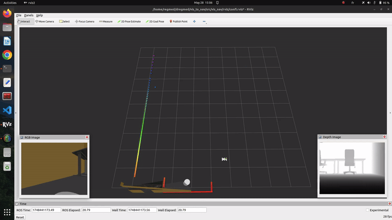
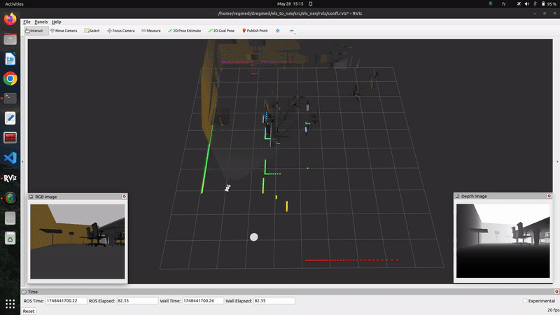
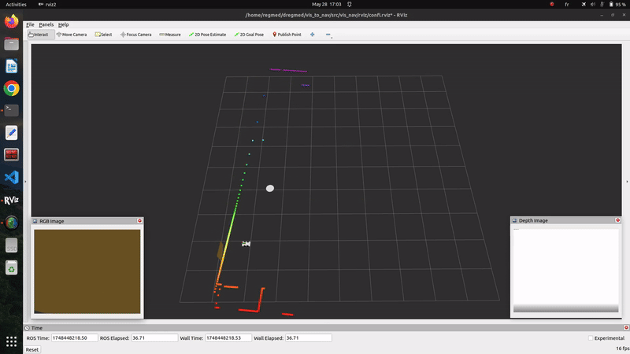
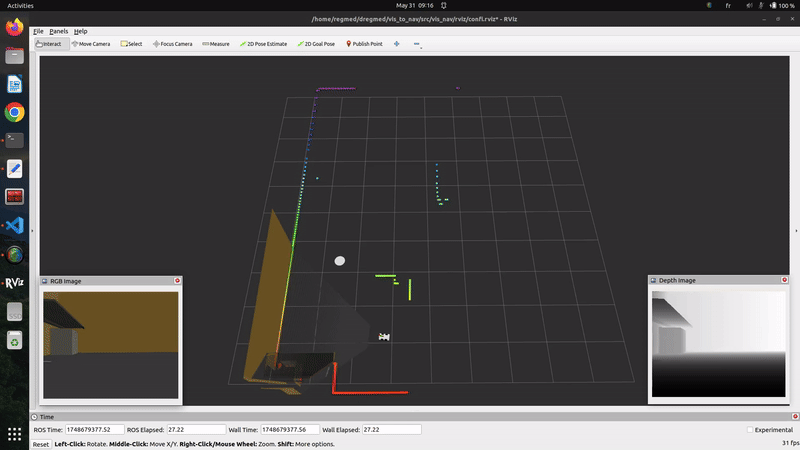
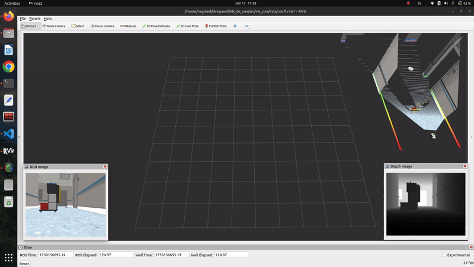
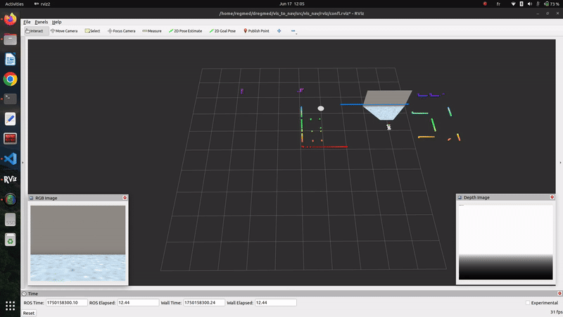
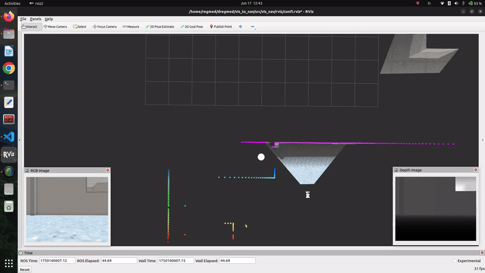
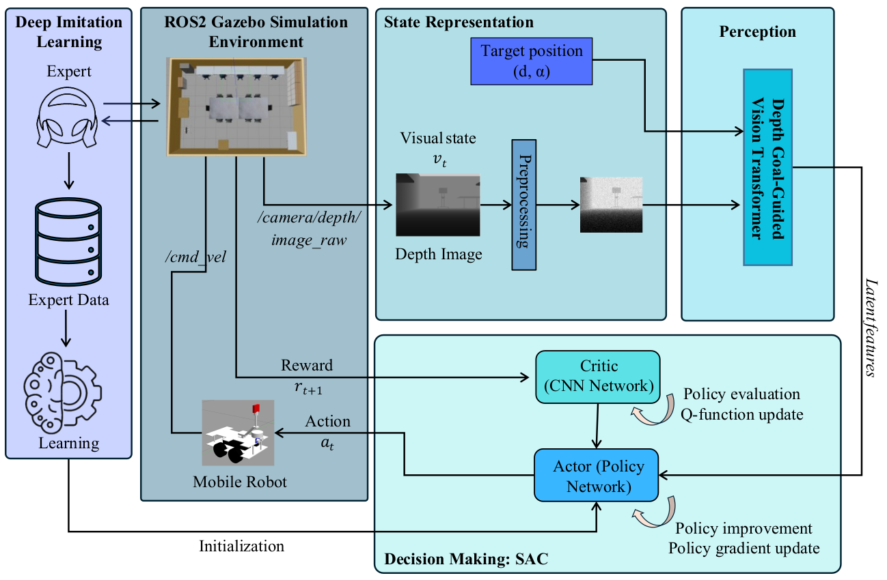
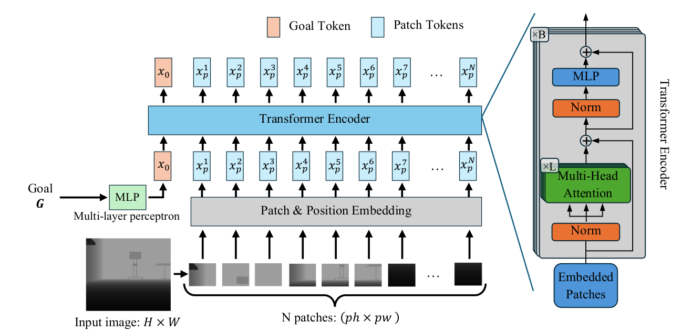
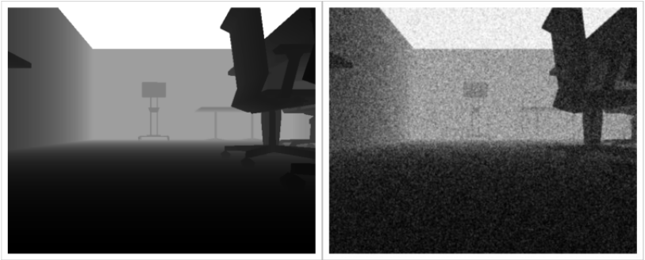

# DGViT  
## Depth & Goal-Guided Vision Transformer for Visual Navigation

📄 **Attention in Depth for Visual Navigation of a Mobile Robot**

---

## 🚀 Overview

**DGViT (Depth & Goal-Guided Vision Transformer)** is a visual navigation framework for mobile robots that leverages **Transformer-based attention mechanisms** and **depth perception** to enable robust goal-directed navigation.

A **car-like mobile robot** learns to autonomously navigate toward a **random goal position** using:

- Raw **RGB images** from a **single fisheye camera**
- **Goal information** expressed in **polar coordinates**
- **Depth cues** to enhance spatial awareness and obstacle avoidance

The framework is implemented in a **ROS 2 Gazebo simulation environment** and designed for **sim-to-real transfer**.

**Platform**
- Ubuntu 22.04  
- ROS 2 Humble  
- Gazebo Fortress  
- PyTorch  

---

## 🎥 Simulation Preview

### Training Environment

  
  
  
  
  
  
  
  
  

---

### Unseen Environment (Generalization)

  
  
  
  
  
  

---

## 📦 Dependencies

### Core Requirements

1. **ROS 2 Humble**  
   https://docs.ros.org/en/humble/Installation.html  

2. **Gazebo Fortress**  
   https://gazebosim.org/docs/fortress/install_ubuntu/  

3. **PyTorch**  
   https://pytorch.org/get-started/locally/  

---

## 🧪 Installation & Usage

### 1️⃣ Create a Python Virtual Environment (Recommended)

```bash
conda create -n dgvit python=3.10
```

### 2️⃣ Activate the Environment

```bash
conda activate dgvit
```

### 3️⃣ Install Python Dependencies

```bash
pip install numpy tqdm natsort cpprb matplotlib einops squaternion             opencv-python rospkg rosnumpy pyyaml
```

### 4️⃣ Install ROS 2 Dependencies

```bash
sudo apt install python3-colcon-common-extensions
sudo apt install ros-humble-cv-bridge
```

---

## 🧱 Create a ROS 2 Workspace

```bash
mkdir -p ~/vis_to_nav/src
cd ~/vis_to_nav/src
```

### Clone the Repository

```bash
git clone https://github.com/REGRAGUIahmed/DGViT-Depth-Goal-Guided-Vision-Transformer-.git
```

---

## 🔨 Build the Workspace

```bash
cd ~/vis_to_nav
colcon build
```

### Source the Workspace

```bash
source install/setup.bash
```

---

## ⚙️ Path Configuration (Temporary)

Edit the following files to ensure correct Python path resolution.

### `main.py`

```python
import sys
sys.path.append('/home/<your_username>/vis_to_nav/src/vis_nav/vis_nav')
```

### `env_lab.py`

```
gtrl/scripts/Environments/env_lab.py
```

> ⚠️ This is a temporary workaround. Future versions will remove manual path edits.

---

## 🚀 Training DGViT

```bash
cd ~/vis_to_nav
ros2 launch DGViT-Depth-Goal-Guided-Vision-Transformer training.launch.py
```

---

## 🛑 Stopping All Processes

```bash
killall -9 rosout gzserver gzclient python python3
```

### Optional Alias

Add to `~/.bashrc`:

```bash
alias k9='killall -9 rosout gzserver gzclient python python3'
```

Then run:

```bash
k9
```

---

## 🧠 Framework Overview



---

## 🔬 Depth & Goal-Guided Vision Transformer (DGViT)



---

## 🌫 Noise-Augmented Depth Images



## 📜 License

This project is intended for **research and academic use**.  
If you use this work in your research, please **cite appropriately**.